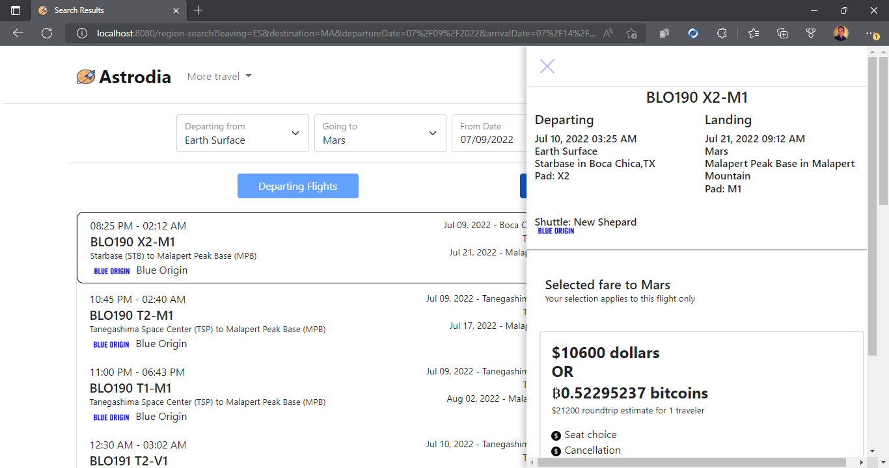
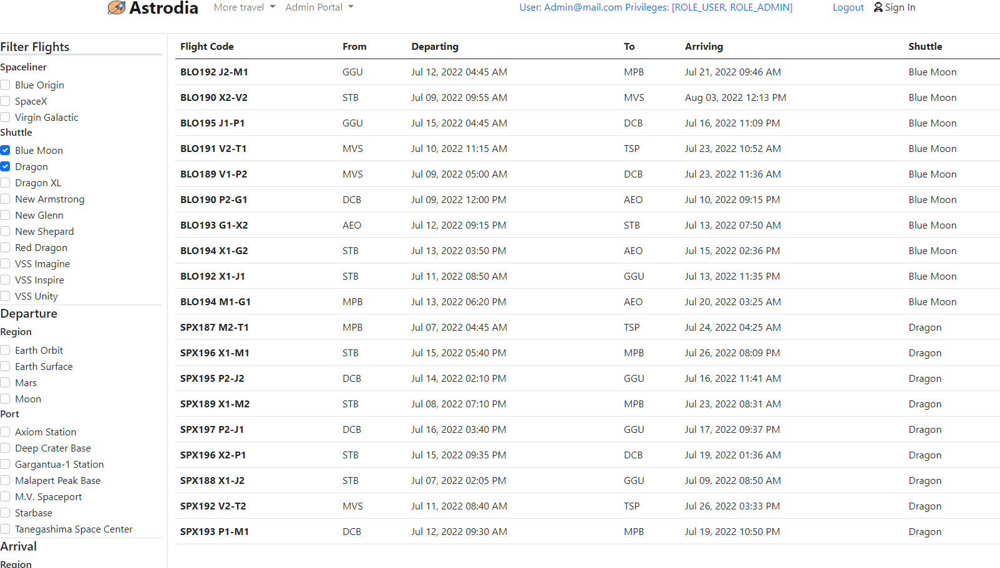
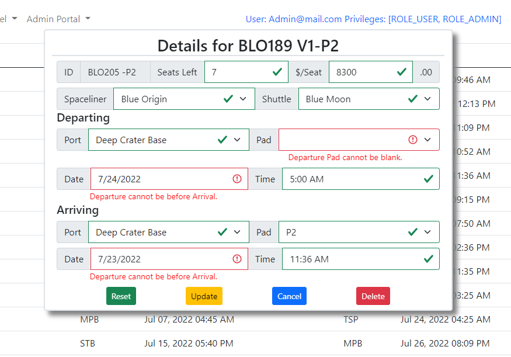
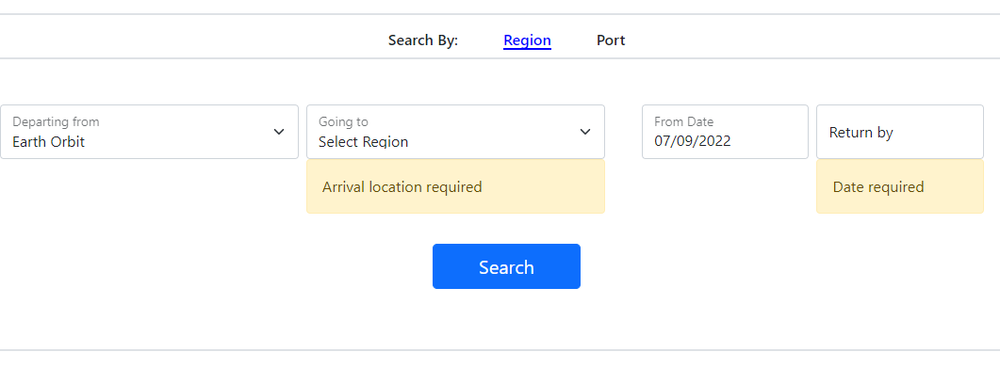

# Astrodia.com
## A space travel site for the future
- Inspired by the burgeoning privatization of space travel.
- Future space travelers will need a resource for searching, purchasing and planning out their travel needs.
- Enter Astrodia, a travel site where clients can browse and search for scheduled off world shuttle flights.
- Modelled after Expedia.com.
---
https://user-images.githubusercontent.com/64939708/177612022-5360ce09-54ad-4f1c-bcd5-bf4b5d552f60.mp4
## Technology Stack
- Spring Boot
    - Starter Web
    - Starter JPA
    - Starter Validation
    - Starter Security
- Thymeleaf
    - Thymeleaf SpringSecurity5
- Lombok
- Database
    - MariaDB
- Testing
    - AssertJ
    - JUnit Jupiter v5.8.2
        - Params
        - Suite
- Front-End
    - Webjars
        - Bootstrap v5.0.0
        - JQuery v3.6.0
        - JQuery-UI v1.13.0
---
### Search Results Page

- Utilize Javascript and JQuery
  - DOM manipulation
  - Fetch() method for asynchronous requests
    - Dynamically render Flight details returned from Rest Controller endpoint
    - Used to convert current dollars to bitcoin amount via https://blockchain.info/tobtc?currency=USD&value=<dollar amount>
### Admin Portal

- Make use of Java Criteria Builder API for dynamic query creation
  - Dynamically construct a URL with selection criteria parameters using Javascript URLSearchParams() method
  - fetch() results and render page with flights matching selection criteria asynchronously
### Javascript Client Side Form Validation

- Bootstrap styling with custom validations
- Javascript and Jquery for reactive form inputs
### Server Side Validation Using Spring Validation

- Spring Validation with Thymeleaf for form validation
---

