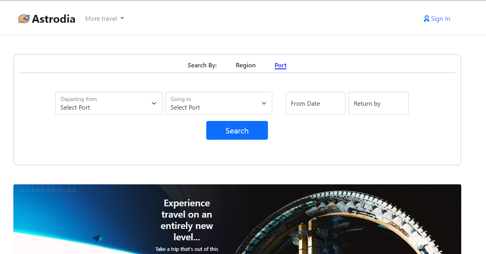

# Astrodia.com
## A space travel site for the future
- Inspired by the burgeoning privatization of space travel.
- Future space travelers will need a resource for searching, purchasing and planning out their travel needs.
- Enter Astrodia, a travel site where clients can browse and search for scheduled off world shuttle flights.
- Modelled after Expedia.com.
  
---
## Technology Stack
- Spring Boot
    - Starter Web
    - Starter JPA
    - Starter Validation
    - Starter Security
- Thymeleaf
    - Thymeleaf SpringSecurity5
- Lombok
- Database
    - MariaDB
      Testing
    - H2
    - AssertJ
    - JUnit Jupiter v5.8.2
        - Params
        - Suite
- Front-End
    - Webjars
        - Bootstrap v5.0.0
        - JQuery v3.6.0
        - JQuery-UI v1.13.0
---

https://user-images.githubusercontent.com/64939708/177612022-5360ce09-54ad-4f1c-bcd5-bf4b5d552f60.mp4

